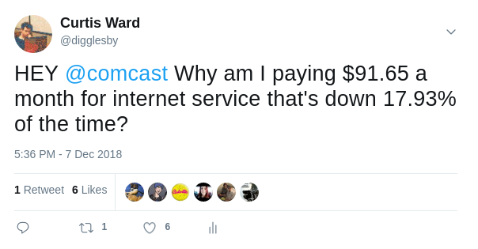

# Complaint Bot

Automated complaint [tweets to your ISP](https://twitter.com/digglesby/status/1071216793690222594)



The bot is configured to attempt to ping a given IP address at a set interval and record it's results to a JSON file. At a second set interval the bot will attempt to post a tweet with your uptime when your connection appears to be working.

## Installation
Before you get started:
* Install Node and NPM
* Get both a developer account and *access token* from the [Twitter developer site](https://developer.twitter.com/content/developer-twitter/en.html)

After cloning and navigating to the repo directory:

1. Add your developer information to index.js
2. Change the tweet the in index.js
3. ```npm install```
4. ```npm run start```

## Data
*I'll be uploading some of my data to a separate repo soon.* If you would like to link some of your uptime data here submit a PR.

## Contributing
**PRs Welcome!**
This is just a little side project for me, feel free to make improvements.

Message me on twitter [@digglesby](https://twitter.com/digglesby) or at my website [www.digglesby.com](https://www.digglesby.com)
